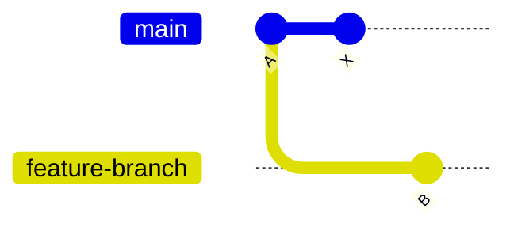
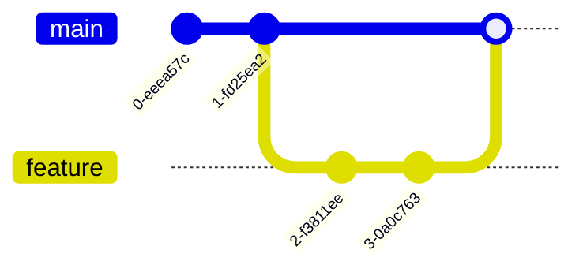
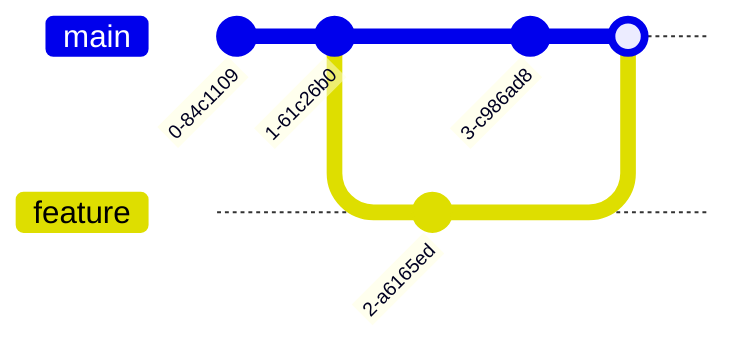

# Git in Practice

## Introduction / Setup

Now that you've learned about how Git actually works under the hood, we can start learning about how to use Git. There are a variety of interfaces avaliable to interact with Git, like the command line, various GUIs, tools like GitHub, and more. In this lesson, we'll focus on the command line version. If you don't have Git installed on your machine, install it using the instructions [here](https://git-scm.com/book/en/v2/Getting-Started-Installing-Git). You may also need to complete some some [first time setup](https://git-scm.com/book/en/v2/Getting-Started-First-Time-Git-Setup) which we will not be covering here.

Note that a lot of this content is referenced from the [Pro Git book](https://git-scm.com/book/en/v2), with the respective liscense found [here](https://creativecommons.org/licenses/by-nc-sa/3.0/). I've also heavily referenced the excellent [Beej's Guide To Git](https://beej.us/guide/bggit/) for structure and examples.

### Getting Started with Repositories

The first thing you'll need to do when working with Git is to get your Git repository. This is done either by taking a local directory and converting it into a Git repository or by cloning an existing Git repository from somehwere like GitHub.

#### Initializing A Local Repository Using `git init`

To create a new Git repository, navigate to your desired directory and run:

```bash
git init
```

This creates a `.git` subdirectory that stores all version control data, including objects, references, and the commit history.

#### Cloning an Existing Repository

To copy an existing repository from services like GitHub or GitLab, use:

```bash
git clone <url>
```

This command:

- Creates a new directory named after the project
- Downloads the complete repository history, including all commits and branches
- Sets up your working directory with files from the default branch (typically main or master)

Git supports both HTTPS and SSH protocols for cloning, which you can choose based on your authentication requirements. While cloning is typically done once at the start of working with a repository, you can also clone specific branches if needed.

## Basic Git Workflow

The basic workflow follows five simple steps that you'll repeat each time you want to make and save changes. Note that this ties back to the concepts we talked about in the Git Theory section.

First, you'll work on your files locally, making whatever changes you need to your code or documents. Think of this as your normal editing process. This is also known as making changes in your working directory.

Next, you'll tell Git which changes you want to include in your next snapshot using the "staging" process. This gives you control over exactly which modifications will be saved. This is called staging your changes.

Third, you'll create a "commit", which is taking a snapshot of your staged changes, along with a message describing what you changed and why.

Fourth, you'll send your committed changes to GitHub (or another remote repository). This is called "pushing" your changes.

You can then repeat this changes as time progresses. Note that this isn't the *only* workflow that is used, just a very common one.

We've covered the theoretical idea behind all of these concepts previously, but now we'll talk about the commands for these operations.

## Core Git Operations

Now that we have a repository, we'll walk through the workflow and the associated command one by one. For this section, we'll be starting with an empty directory and run `git init` to initialize our repository.

### Making Changes

Before we make any changes, we can ask Git what the current status of the local repository is by using the `git status` command.

```bash
❯ git status
On branch main

No commits yet

nothing to commit (create/copy files and use "git add" to track)
```

This tells us that we are currently on the `main` branch. Recall from the previous lesson that branches are a reference to a specific commit and allow for parallel tracks of development. It also tells us that we haven't made any commits yet and that there aren't any changes to commit.

Let's start by creating a file called `hello.py`, with the contents of:

```python
print("Hello, world!")
print("Welcome to CMSC398W!")
```

Once we save the file and run `git status` again, we see that:

```bash
❯ git status
On branch main

No commits yet

Untracked files:
  (use "git add <file>..." to include in what will be committed)
        hello.py

nothing added to commit but untracked files present (use "git add" to track)
```

This tells us that Git has detected that we have created a file named hello.py that is not currently *tracked* by Git. Recall that files in Git can be either untracked or tracked, where untracked means that it hasn't added to version control, while tracked has. It also says that there is "nothing added to commit but untracked files present", which means that we haven't *added* any of our modified files to the *staging area* so we can *commit* them. Hopefully its started to get clearer why understanding the various terminologies and data models is useful when using Git. So, let's do exactly that and add our changes to the staging area.

#### Staging (git add)

We can use the `git add` command to stage changes to prepare to commit. We can either stage all of the changes in your directory, or stage specific files. Let's look at an example:

```bash
❯ git add hello.py
❯ git status
On branch main

No commits yet

Changes to be committed:
  (use "git rm --cached <file>..." to unstage)
        new file:   hello.py
```

This has changed the message from "Untracked files" to now tell us that what changes are currently ready to be committed, namely, the new file hello.py. If we accidentally staged the file and want to unstage it, a helpful message is included as well.

#### Committing (git commit)

Now that our changes have been added to the staging area, we can commit them. Only files that are added to the staging area will be committed, so if I change a file but don't call either `git add .` (stage all the changes in the current directory) or `git add <filename>`, that change won't be committed. With each commit, you include a message that describes what a change in, why it was made, and other information.

```bash
❯ git commit -m "added hello.py for testing"
[main (root-commit) 34903ef] added hello.py for testing
 1 file changed, 2 insertions(+)
 create mode 100644 hello.py
```

This tells us that we have committed to the main *branch* with the message of "added hello.py for testing". In this commit, we've changed 1 file and inserted two lines. It also says we've created file hello.py (mode 100644 just indicates the file permissions, but generally is not something you need to worry about).

#### Pushing (git push)

If we cloned our repository from a pre-existing remote repository, we could then push our changes. Since we created this repository locally, we don't have a remote to push to, but we'll work more with remotes and how to use them in a later section.

### Viewing History (git log)

Now that we've added our changes and committed them, we can see all of our commits within a log, accessible (unsurprisingly) via `git log`.

```bash
❯ git log

commit 34903ef910501690b5c619da5378c2d4b3fd82dc (HEAD -> main)
Author: John Doe <johndoe@gmail.com>
Date:   Tue Mar 4 22:40:00 2025 -0500

    added hello.py for testing
```

This gives us the SHA-1 hash for the commit Recall that everything in Git is generally addressed by it's SHA-1 hash, which makes it easy to identify a particular commit if you needed to go back in history. This commit is also at the "tip" of the `main` branch. It tells us who made the commit, the time it was made, and the commit message. If we add another commit, the log grows like a stack.

```bash
❯ git log

commit 0b142e96b92f9f07c54ecc3f4c22a068f0eac8ea (HEAD -> main)
Author: John Doe <johndoe@gmail.com>
Date:   Tue Mar 4 22:51:59 2025 -0500

    added goodbye

commit 34903ef910501690b5c619da5378c2d4b3fd82dc
Author: John Doe <johndoe@gmail.com>
Date:   Tue Mar 4 22:40:00 2025 -0500

    added hello.py for testing
```

### Understanding HEAD

In our previous log outputs, you might have noticed the term `HEAD` appearing. HEAD is Git's way of tracking "where you are right now" in the repository's history - think of it as a pointer to your current location. Most of the time, HEAD points to the name of the current branch (in our case, `main`), which in turn points to the latest commit on that branch.

Let's look at our current situation:

```bash
❯ git log
commit 0b142e96b92f9f07c54ecc3f4c22a068f0eac8ea (HEAD -> main)
Author: John Doe <johndoe@gmail.com>
Date:   Tue Mar 4 22:51:59 2025 -0500

    added goodbye

commit 34903ef910501690b5c619da5378c2d4b3fd82dc
Author: John Doe <johndoe@gmail.com>
Date:   Tue Mar 4 22:40:00 2025 -0500

    added hello.py for testing
```

Here, `(HEAD -> main)` tells us that HEAD is pointing to the `main` branch, which is at commit `0b142e9`. When working with branches, we use the modern `git switch` command to move between them:

```bash
❯ git switch main     # Switch to main branch
```

We can also look at previous commits directly, which creates a "detached HEAD" state:

```bash
❯ git checkout 34903ef
Note: switching to '34903ef'.

You are in 'detached HEAD' state...
```

This brings us to an important concept: the "detached HEAD" state. A detached HEAD occurs when you point HEAD directly to a commit instead of a branch. This is like being in a time machine - you can look around, but any changes you make won't be connected to any branch. Here's a visualization:

Normal HEAD:

```bash
HEAD -> main -> commit 0b142e9
```

Detached HEAD:

```bash
main -> commit 0b142e9
HEAD -> commit 34903ef
```

While in a detached HEAD state, you can:

- Look at files as they were at that point in time
- Make experimental changes
- Create new commits

However, since HEAD isn't attached to a branch, any new commits you make will be "floating" and could be lost when you switch to a different commit. If you want to keep changes made in a detached HEAD state, you should create a new branch:

```bash
❯ git switch -c old-version   # Create and switch to new branch
```

We'll talk more about branches in the next section.

To get back to your latest work, you can always return to your main branch:

```bash
❯ git switch main
```

This will reattach HEAD to the main branch and bring you back to your most recent commit.

## Branching and Merging

Branching is one of Git's most powerful features, allowing developers to work on multiple versions of their code simultaneously. Building on our understanding of Git's data model, we know that branches are just pointers to specific commits in the repository's history.

### Creating and Managing Branches

There are two main commands for working with branches:

- `git branch`: Lists, creates, or deletes branches
- `git switch`: Moves between branches (or creates and switches with `-c`)

To create a new branch:

```bash
git switch -c feature-branch  # Create and switch to new branch
# or
git branch feature-branch     # Create branch only
git switch feature-branch     # Switch to branch
```

To list all branches:

```bash
git branch  # The current branch is marked with an asterisk (*)
```

To delete a branch:

```bash
git branch -d feature-branch  # Safe delete (prevents deletion of unmerged changes)
git branch -D feature-branch  # Force delete (use with caution)
```

### Understanding Branch Operations

When you create a branch, Git simply creates a new pointer to the current commit. Once you switch / checkout to the new branch, the HEAD reference is updated to point to your new branch, indicating which branch you're currently working on.

For example, if you're on the main branch and create a new feature branch:

1. Initially:

   ```bash
   main    → commit A
   HEAD    → main
   ```

2. After creating and switching to feature-branch:

   ```bash
   main           → commit A
   feature-branch → commit A
   HEAD          → feature-branch
   ```

3. After making a new commit on feature-branch:

   ```bash
   main           → commit A
   feature-branch → commit B
   HEAD          → feature-branch
   ```



## Merging Branches

Git provides several strategies for combining work from different branches. Understanding these strategies is crucial for maintaining a clean and manageable repository history. Types of merges include:

1. **Fast-Forward Merge**
   - Occurs when there are no new commits on the target branch
   - Simply moves the branch pointer forward
   - Creates a linear history
   - No merge commit is created


This diagram shows a fast-forward merge scenario. Notice how all commits in the feature branch are direct descendants of the main branch's last commit. When merged, the main branch pointer simply moves forward to the latest feature branch commit, creating a straight line of history without any merge commits.

2. **Three-Way Merge (Recursive)**
   - Used when branches have diverged
   - Creates a new merge commit
   - Preserves complete history of both branches
   - May require conflict resolution


This diagram demonstrates a three-way merge. The branches have diverged - both main and feature branches have received unique commits. The merge creates a new commit (shown as the merge node) that combines both histories. This preserves the complete development history of both branches and shows exactly where they were integrated.

There are additional merge strategies avaliable, but we will focus on these two.

### Fast-Forward Merges

A fast-forward merge is the simplest type of merge, occurring when the branch you're merging from is a direct descendant of the branch you're merging into. In other words, no other commits were made to the target branch since the feature branch was created.

To perform a merge:

```bash
git switch main          # Switch to the target branch
git merge feature-branch # Merge changes from feature-branch
```

During a fast-forward merge:

1. Git checks if a fast-forward is possible
2. If yes, it simply moves the target branch pointer forward to match the source branch
3. No new commit is created

### Creating and Resolving Merge Conflicts

When Git can't automatically merge changes, it creates a merge conflict. This typically happens when:

- The same file was modified in different ways on both branches
- A file was modified on one branch and deleted on another
- A file was added with the same name but different content on both branches

When a conflict occurs:

1. Git marks the conflicting sections in the affected files
2. The merge process pauses
3. You must manually resolve the conflicts
4. After resolution, you create a new commit

Example of a conflict marker:

```
<<<<<<< HEAD
Your changes on the current branch
=======
Changes from the branch being merged
>>>>>>> feature-branch
```

To resolve a conflict:

1. Open the conflicting files
2. Choose which changes to keep (or combine them)
3. Remove the conflict markers
4. Stage the resolved files (`git add`)
5. Complete the merge (`git commit`)

## Working with Remotes

### Remote Repository Basics

### Remote Tracking Branches

### Pushing and Pulling

### Managing Multiple Remotes

## Common Git Tasks

### Comparing Changes (git diff)

### File Operations

#### Renaming Files

#### Removing Files

### Stashing Changes

### Amending Commits

## Advanced Git Operations

### Rebasing

#### Basic Rebasing

#### Interactive Rebasing

#### Squashing Commits

### Reverting Changes

### Reset Operations

#### Soft, Mixed, and Hard Reset

#### Safe Reset Practices

## GitHub Collaboration

### Forking Repositories

### Pull Requests

#### Creating Pull Requests

#### Managing Pull Requests

#### Syncing with Upstream

### Best Practices for Contribution
