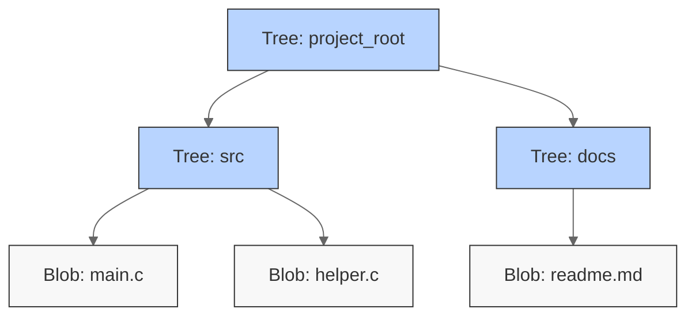
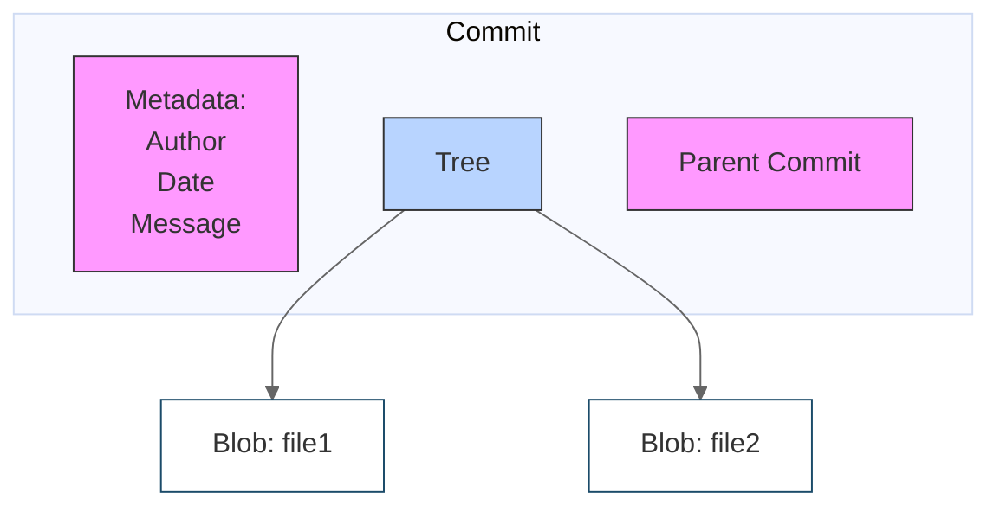
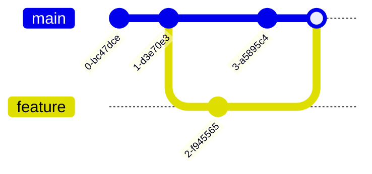
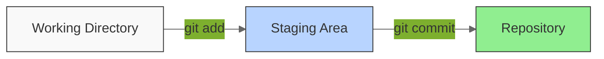

# Git Theory

## Why Version Control?

Version control systems (VCSs) are tools used to track changes to source code (or other collections of files and folders). As the name implies, these tools help maintain a history of changes; furthermore, they facilitate collaboration. VCSs track changes to a folder and its contents in a series of snapshots, where each snapshot encapsulates the entire state of files/folders within a top-level directory. VCSs also maintain metadata like who created each snapshot, messages associated with each snapshot, and so on.

Why is version control useful? Even when you're working by yourself, it can let you look at old snapshots of a project, keep a log of why certain changes were made, work on parallel branches of development, and much more. When working with others, it's an invaluable tool for seeing what other people have changed, as well as resolving conflicts in concurrent development.

Modern VCSs also let you easily (and often automatically) answer questions like:

* Who wrote this module?
* When was this particular line of this particular file edited? By whom? Why was it edited?
* Over the last 1000 revisions, when/why did a particular unit test stop working?

Over time, Git has emerged as the de facto standard for version control systems. However, many developers learn Git through memorizing commands without understanding its elegant underlying design. This approach often leads to confusion when things go wrong, as developers lack the theoretical foundation to reason about Git's behavior.

This text takes a different approach. Instead of starting with commands, we'll build understanding from the ground up by exploring Git's data model and theoretical foundations. When you understand these fundamentals, you'll be able to reason about Git's behavior rather than memorizing commands, solve complex version control problems with confidence, and develop mental models that translate across different Git workflows.

## The Data Model: How Git Stores Your Code

Git is a content-addressable filesystem, meaning all objects are stored and retrieved based on their content rather than their location. When you add content to Git, it generates a hash based on that content which is then used to store and retrieve the content.

### Blobs

The most basic unit in Git's data model is the blob (binary large object). A blob represents the contents of a file, stripped of all metadata. When you add a file to Git, its contents are stored as a blob, identified by a SHA-1 hash of its content. The same file content always produces the same blob hash, regardless of where it appears in your project or what you name the file. Blobs are immutable and make it so that if you have the same file content in multiple places in your project, Git only stores it once. If you modify a file, Git creates a new blob, leaving the original untouched.

### Trees

While blobs store content, they don't maintain structure or metadata. Git uses trees to organize blobs into directories and provide metadata like file names. A tree object is essentially a snapshot of a directory structure, mapping names to blobs (for files) or other trees (for subdirectories).

## History: Tracking Changes Over Time

### Commits

A commit represents a snapshot of your project at a specific point in time. Its important to realize that Git isn't storing deltas between commits, it is storing a complete "snapshot" of the entire project. Each commit contains:

* A pointer to the tree representing the project's state
* Pointers to parent commit(s)
* Metadata about who made the change and why (commit message)
* A timestamp

Once created, a commit cannot be changed without affecting all commits that come after it, since each commit is identified by a hash of its contents, including the parent commit hash.

### The Commit Graph

As you make commits, Git builds a directed acyclic graph (DAG) of your project's history. In simpler terms, this means is that each snapshot in Git refers to a set of "parents" / the snapshots that preceded it. Note that a snapshot can have multiple parents, if for example two branches of development were merged into a single commit.

This graph structure enables Git's powerful branching and merging capabilities.

## References: Naming Points in History

References provide human-readable names to specific points in your commit history. Git uses two main types of references:

1. **Branches**: Mutable references that automatically point to the latest commit in a line of development. When you commit changes, the current branch reference updates to point to the new commit. Creating a branch is lightweight because Git just creates a new reference pointing to an existing commit—no content is copied.

2. **Tags**: Immutable references that permanently mark specific commits, typically used for releases (e.g., v1.0.0).

HEAD is a special reference that points to the commit you're currently working with, usually through a branch. For example, when you're working on the main branch, HEAD points to main, which points to a specific commit.

## Git's Working Spaces

Git works with two primary "spaces":

1. The Repository (.git directory): Where Git stores all history, metadata, and the database of all versions of your project
2. The Working Directory: Where you actually edit your files and create new content

Git transforms changes in your working directory into permanent history in your repository through a series of states and transitions. You will see this terminology used often when working with git commands.

### File States

Files in your working directory can exist in several states:

1. **Untracked**: Files that Git doesn't yet manage. These are files in your working directory that have never been added to Git's version control.

2. **Tracked**: Files that Git is actively managing, which can be in three sub-states:
   * **Unmodified**: Files that haven't changed since your last commit
   * **Modified**: Files that have changed but haven't been staged
   * **Staged**: Modified files that are marked for inclusion in your next commit

### The Staging Area

The staging area, also known as the "index", is an intermediate state between your working directory and repository. It represents the changes you're preparing to permanently record in your next commit. One common usecase of the staging area is if you want to only include some changes in a commit, you can stage just those changes and push the others seperately.

When you stage changes with git add:

* Git creates new blob objects for the changed files
* Updates the index tree to point to these new blobs
* When you commit, this tree becomes your new commit's root tree

## Workflow

On disk, all Git stores are objects and references: that's all there is to Git's data model. All git commands map to some manipulation of the commit DAG by adding objects and adding/updating references.

When you work with Git, work progresses as:

1. Files in your working directory are tracked according to their state (untracked, modified, staged, or unmodified)
2. When you stage changes, Git:
   * Creates immutable blobs from file contents
   * Updates the staging area's tree structure
   * Maintains all the metadata needed for the eventual commit
3. When you commit, Git:
   * Creates a new commit object pointing to the staged tree
   * Updates references (like your current branch) to point to the new commit
   * Adds the commit to the repository's history graph

Whenever you're typing in any command, think about what manipulation the command is making to the underlying graph data structure. Conversely, if you're trying to make a particular kind of change to the commit DAG, e.g. "discard uncommitted changes and make the 'master' ref point to commit 5d83f9e", there's probably a command to do it (e.g. in this case, git checkout master; git reset --hard 5d83f9e).
