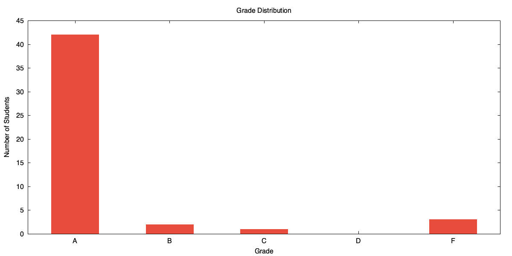

#+Title: Course Overview and The Shell
#+SUBTITLE: CMSC398W: Practical Tools For Efficient Development
#+AUTHOR: Mohammad Durrani
#+DATE: \today
#+OPTIONS: H:2 toc:nil num:nil
#+STARTUP: beamer
#+LATEX_CLASS: beamer
#+LATEX_CLASS_OPTIONS: [presentation,aspectratio=169]
#+BEAMER_THEME: Madrid
#+BEAMER_COLOR_THEME: dolphin
#+BEAMER_FONT_THEME: structurebold
#+LATEX_HEADER: \setbeamertemplate{navigation symbols}{}
#+LATEX_HEADER: \setbeamertemplate{footline}[frame number]
#+LATEX_HEADER: \usepackage{tikz}
#+LATEX_HEADER: \usetikzlibrary{shapes,arrows,positioning,shadows,calc}
#+LATEX_HEADER: \usepackage{pgfplots}
#+LATEX_HEADER: \usepgfplotslibrary{polar}
#+LATEX_HEADER: \pgfplotsset{compat=1.18}
#+LATEX_HEADER: \usepackage[height=1890]{beamer-reveal}
#+COLUMNS: %45ITEM %10BEAMER_ENV(Env) %10BEAMER_ACT(Act) %4BEAMER_COL(Col)

* About The Class
** Icebreaker
*** Please share in the Zoom chat:
:PROPERTIES:
:BEAMER_ENV: block
:END:
1. Your year (Freshman, Sophomore, Junior, Senior)
2. Either:
   - One thing you did over break, *OR*
   - What you hope to learn from this class

** About The Class
*** Course Information
:PROPERTIES:
:BEAMER_ENV: block
:END:
*CMSC398W: Practical Tools For Efficient Development*
- Overview of tools used in development: command line, Git, debuggers, build systems, etc.

** About Me - Mohammad

***                                                              :B_columns:
:PROPERTIES:
:BEAMER_ENV: columns
:END:

**** Profile                                                        :BMCOL:
:PROPERTIES:
:BEAMER_COL: 0.55
:END:

*Mohammad Durrani*

- Senior
- CS + Math, minor in Robotics
- *Previous Experience:*
  - Teaching this class since Spring 2025
  - SWE Intern at Google in SF
  - SWE Intern at TRX Systems in Greenbelt

**** Interests                                                      :BMCOL:
:PROPERTIES:
:BEAMER_COL: 0.4
:END:

*Hobbies:*

- Rock climbing
- Basketball
- Robots

** What To Expect

*** Course Structure
:PROPERTIES:
:BEAMER_ENV: block
:END:

*Read the syllabus for all course-related information!*

***                                                              :B_columns:
:PROPERTIES:
:BEAMER_ENV: columns
:END:

**** In Class                                                       :BMCOL:
:PROPERTIES:
:BEAMER_COL: 0.48
:END:

- Introduction of topic
- Motivation / real-world example
- Technical details

**** Out of Class                                                   :BMCOL:
:PROPERTIES:
:BEAMER_COL: 0.48
:END:

- Projects focusing on application
- Best way to learn: *use them*

** Course Logistics

*** Communication & Submission
:PROPERTIES:
:BEAMER_ENV: alertblock
:END:

- All course communication: *Piazza*
- All assignments submitted: *Gradescope*
- *10% per-day late penalty* (except the last project)

*** Grade Breakdown
:PROPERTIES:
:BEAMER_ENV: block
:END:

| Percentage | Title                       | Description                              |
|------------+-----------------------------+------------------------------------------|
| 80%        | Projects (20% per)          | 4 Major Projects                         |
| 15%        | Application Days (5% per)   | Completion of Application Days           |
| 5%         | Participation               | Participation in class                   |

** Application Days

*** Based on Feedback
:PROPERTIES:
:BEAMER_ENV: block
:END:

Based on feedback from the previous iteration, we'll have days focused on using the tools we learn in class on toy problems.

*** Three Application Days
:PROPERTIES:
:BEAMER_ENV: exampleblock
:BEAMER_ACT: <2->
:END:

1. *Shell*
2. *Git*
3. *Networking*

#+BEAMER: \vspace{0.3em}
(Subject to change)

** Grade Distribution
#+BEGIN_SRC gnuplot :file grade-pie.png :exports results
set terminal pngcairo size 1200,600
set output 'grade-pie.png'
set title "Grade Distribution"
set xlabel "Grade"
set ylabel "Number of Students"
set style fill solid
set boxwidth 0.5
set yrange [0:*]
set xtics ("A" 1, "B" 2, "C" 3, "D" 4, "F" 5)
plot '-' using 1:2 with boxes lc rgb "#e74c3c" notitle
1 42
2 2
3 1
4 0
5 3
e
#+END_SRC

#+RESULTS:
#+ATTR_LATEX: :width 0.7\textwidth

* The Shell

** What is the Shell?

*** Shell
:PROPERTIES:
:BEAMER_ENV: definition
:END:

A text-based interface to the operating system.

*** Terminal vs Shell
:PROPERTIES:
:BEAMER_ENV: block
:BEAMER_ACT: <2->
:END:

| Component | Role | Examples |
|-----------+------+----------|
| *Terminal* | The application that runs the shell | iTerm2, Windows Terminal |
| *Shell* | Interprets and runs commands | bash, zsh, fish |

** Why Do We Need It?

*** Power & Efficiency
:PROPERTIES:
:BEAMER_ENV: block
:END:

#+ATTR_BEAMER: :overlay +-
- *Speed:* Automate repetitive tasks
- *Control:* Do things GUIs simply can't
- *Remote Machines:* The standard way to manage servers

*** Why Bash?
:PROPERTIES:
:BEAMER_ENV: alertblock
:BEAMER_ACT: <2->
:END:

We focus on *Bash* because it's common and the skills are largely transferable.
On macOS the default interactive shell is often =zsh=, but the core concepts and scripting translate.

** The Prompt

*** Anatomy of the Prompt
:PROPERTIES:
:BEAMER_ENV: block
:END:

=username@host:directory$=

*** Components
:PROPERTIES:
:BEAMER_COL: 1.0
:END:

| Component   | Description                      |
|-------------+----------------------------------|
| username    | Currently logged in user         |
| @           | Separator (convention)           |
| host        | Machine name                     |
| directory   | Current working directory        |
| $           | User-level shell indicator       |
| =#=         | Root-level shell indicator       |

** Basic Commands
:PROPERTIES:
:BEAMER_OPT: fragile
:END:

*** How It Works
:PROPERTIES:
:BEAMER_ENV: block
:END:

Type command → shell splits on whitespace → runs program with arguments

Prompts vary and are customizable (your =PS1= controls this).

*** Examples
:PROPERTIES:
:BEAMER_ENV: exampleblock
:BEAMER_ACT: <2->
:END:

#+BEGIN_SRC bash
date                    # Show date/time
echo hello              # Print text
echo "Hello World"      # Handle spaces
ls -l ~                # Command with flags
#+END_SRC

** File Paths

*** Types
:PROPERTIES:
:BEAMER_ENV: block
:END:

*Absolute:* =/home/user/docs= (from root)

*Relative:* =../other/file.txt= (from current location)

*** Special Symbols
:PROPERTIES:
:BEAMER_ENV: exampleblock
:BEAMER_ACT: <2->
:END:

| Symbol | Meaning          |
|--------+------------------|
| =.=    | Current directory |
| =..=   | Parent directory  |
| =~=    | Home directory    |

** Essential Navigation Commands

*** Why?
:PROPERTIES:
:BEAMER_ENV: block
:END:
How do you know where you are in a system with millions of files?

*** Commands
:PROPERTIES:
:BEAMER_ENV: block
:BEAMER_ACT: <2->
:END:

| Command          | Description                         |
|------------------+-------------------------------------|
| =pwd=     | Print working directory             |
| =cd <dir>=      | Change directory                    |
| =ls [dir]=      | List directory contents             |
| =ls -l=   | Long format listing                 |
| =ls -a=   | Show hidden files                   |
| =ls -lh=  | Human-readable sizes                |

** Navigation Examples
:PROPERTIES:
:BEAMER_OPT: fragile
:END:

***                                                              :B_columns:
:PROPERTIES:
:BEAMER_ENV: columns
:END:

**** Our Filesystem Structure                                       :BMCOL:
:PROPERTIES:
:BEAMER_COL: 0.48
:BEAMER_ENV: block
:END:

#+BEGIN_SRC text
/ (root)
├── bin/
├── home/
│   └── user/
│       ├── docs/
│       └── photos/
└── usr/
#+END_SRC

**** Using Navigation Commands                                      :BMCOL:
:PROPERTIES:
:BEAMER_COL: 0.48
:BEAMER_ENV: exampleblock
:BEAMER_ACT: <2->
:END:

#+BEGIN_SRC bash
$ pwd
/home/user

$ ls -F          # -F adds / to directories
docs/  photos/

$ cd docs
$ pwd
/home/user/docs

$ cd ..
$ pwd
/home/user
#+END_SRC

** Think-Pair-Share: Navigation Puzzle
:PROPERTIES:
:BEAMER_OPT: fragile
:END:

*** The Path
:PROPERTIES:
:BEAMER_ENV: block
:END:

You start in =/home/user/docs=. You run the following command:

#+BEGIN_SRC bash
cd .././photos/../././docs/../../
#+END_SRC

*** The Question
:PROPERTIES:
:BEAMER_ENV: exampleblock
:END:

Where are you now? Work with a partner to trace the path step-by-step.

** Answer
:PROPERTIES:
:BEAMER_ENV: alertblock
:BEAMER_ACT: <2->
:END:

*/home*
#+ATTR_BEAMER: :overlay +-
1. =..= $\rightarrow$ =/home/user=
2. =./photos= $\rightarrow$ =/home/user/photos=
3. =..= $\rightarrow$ =/home/user=
4. =././docs= $\rightarrow$ =/home/user/docs=
5. =../../= $\rightarrow$ =/home=

** File and Directory Manipulation

*** Common Operations
:PROPERTIES:
:BEAMER_ENV: block
:END:

| Command        | Description                         |
|----------------+-------------------------------------|
| =mkdir <dir>= | Make directory                      |
| =touch <file>= | Create empty file / update timestamp|
| =cp <src> <dst>= | Copy files/directories              |
| =mv <src> <dst>= | Move/rename files                   |
| =rm <file>=    | Remove files                        |

*** What do these flags actually do?
:PROPERTIES:
:BEAMER_ENV: alertblock
:BEAMER_ACT: <2->
:END:

#+ATTR_BEAMER: :overlay +-
- *-r*: Recursive (directories)
- *-i*: Interactive (ask before delete)
- *-f*: Force (no prompt)
- *-v*: Verbose (show progress)

** File Manipulation Examples
:PROPERTIES:
:BEAMER_OPT: fragile
:END:

*** Examples
:PROPERTIES:
:BEAMER_ENV: block
:END:

#+BEGIN_SRC bash
# Create nested directories
mkdir -p project/src/utils

# Copy a folder and all its contents
cp -r folder1 folder1_backup

# Rename a file
mv old_name.txt new_name.txt

# Remove a folder and its contents (be careful!)
rm -rf temporary_work
#+END_SRC

** Time to Explore: File Operations
:PROPERTIES:
:BEAMER_OPT: fragile
:END:

*** Challenge
:PROPERTIES:
:BEAMER_ENV: block
:END:

Perform the following tasks using only the shell:

1. Create a directory named =STIC=, and inside it, a directory named =lab1=.
2. Create three empty files in =lab1= named =test1.py=, =test2.py=, and =notes.txt=.
3. Copy =notes.txt= to a new file called =README.md=.
4. Move all =.py= files into a new subdirectory called =src=.
5. Try to remove the =STIC= directory using =rmdir=. Why does it fail?

** Solutions: File Operations
:PROPERTIES:
:BEAMER_OPT: fragile
:BEAMER_ACT: <2->
:END:

*** Steps
:PROPERTIES:
:BEAMER_ENV: exampleblock
:END:

#+BEGIN_SRC bash
# 1. Create nested
mkdir -p STIC/lab1

# 2. Create files
touch STIC/lab1/test1.py STIC/lab1/test2.py STIC/lab1/notes.txt

# 3. Copy
cp STIC/lab1/notes.txt STIC/lab1/README.md

# 4. Move
mkdir STIC/lab1/src
mv STIC/lab1/*.py STIC/lab1/src/

# 5. Why fail?
rmdir STIC  # Fails: "Directory not empty"
rm -r STIC  # Use recursive remove instead!
#+END_SRC

** Viewing File Contents

*** Why not just use VS Code?
:PROPERTIES:
:BEAMER_ENV: block
:END:
What if the file is on a remote server? What if it's 10GB?

*** Viewing Commands
:PROPERTIES:
:BEAMER_ENV: block
:BEAMER_ACT: <2->
:END:

| Command      | Description                           |
|--------------+---------------------------------------|
| =cat <file>= | Display entire file                   |
| =less <file>=| Page through file (q to quit)         |
| =head -n N <file>=| Show first N lines              |
| =tail -n N <file>=| Show last N lines               |
| =tail -f <file>= | Follow file updates (logs)        |

** Viewing Examples
:PROPERTIES:
:BEAMER_OPT: fragile
:END:

*** File Viewing
:PROPERTIES:
:BEAMER_ENV: block
:END:

#+BEGIN_SRC bash
# Display entire file
cat file.txt

# Page through file (Search with /, quit with q)
less file.txt

# First 20 lines
head -n 20 file.txt

# Last 15 lines
tail -n 15 file.txt

# Follow log file as it grows
tail -f /var/log/system.log
#+END_SRC

** Think-Pair-Share: Which tool when?
:PROPERTIES:
:BEAMER_OPT: fragile
:END:

*** Match the tool to the task
:PROPERTIES:
:BEAMER_ENV: block
:END:

1. You want to see the last 5 errors in a log file.
2. You want to read a 1GB text file without crashing your computer.
3. You want to see the first line of every =.txt= file in a directory.
4. You want to watch a log file update in real-time as you run a server.

*** Answers
:PROPERTIES:
:BEAMER_ENV: exampleblock
:BEAMER_ACT: <2->
:END:

#+ATTR_BEAMER: :overlay +-
1. =tail -n 5=
2. =less= (it doesn't load the whole file at once!)
3. =head -n 1 *.txt=
4. =tail -f=

** PATH: Finding Programs

*** How does the shell know where 'ls' is?
:PROPERTIES:
:BEAMER_ENV: block
:END:

The =PATH= environment variable is a list of directories the shell searches through every time you type a command.

*** Key Points
:PROPERTIES:
:BEAMER_ENV: exampleblock
:END:

- Colon-separated list: =/usr/local/bin:/usr/bin:/bin=
- *First match wins:* The shell searches from left to right.
- If it's not in =PATH=, use an explicit path (e.g., =/usr/local/bin/my_prog= or =./my_prog=).

** PATH Variable - Example
:PROPERTIES:
:BEAMER_OPT: fragile
:END:

*** Exploring PATH
:PROPERTIES:
:BEAMER_ENV: block
:END:

#+BEGIN_SRC bash
# Display your PATH
$ echo $PATH
/usr/local/bin:/usr/bin:/bin:/usr/sbin:/sbin

# Find where a command actually lives (portable)
$ command -v ls
/bin/ls

# Run directly without relying on PATH
$ /bin/date
# sample output: Fri Jan 30 14:00:00 EST 2026
#+END_SRC

** Modifying PATH
:PROPERTIES:
:BEAMER_OPT: fragile
:END:

*** Adding to PATH
:PROPERTIES:
:BEAMER_ENV: exampleblock
:END:

#+BEGIN_SRC bash
export PATH="$HOME/my_tools:$PATH"
#+END_SRC

This adds =my_tools= to the beginning of your PATH, giving it priority.

*** Rhetorical Question
:PROPERTIES:
:BEAMER_ENV: alertblock
:BEAMER_ACT: <2->
:END:

Why might it be dangerous to add =.= (current directory) to the *start* of your PATH?

** Environment Variables
:PROPERTIES:
:BEAMER_OPT: fragile
:END:

***                                                              :B_columns:
:PROPERTIES:
:BEAMER_ENV: columns
:END:

**** Definition & Common Vars                                       :BMCOL:
:PROPERTIES:
:BEAMER_COL: 0.48
:END:

***** Definition
:PROPERTIES:
:BEAMER_ENV: definition
:END:

Variables that define the environment in which your programs run.

***** Common Variables
:PROPERTIES:
:BEAMER_ENV: block
:END:

| Var     | Meaning        |
|---------+----------------|
| =PATH=  | Command search |
| =HOME=  | Home directory |
| =USER=  | Username       |
| =PWD=   | Current dir    |

**** Usage Examples                                                 :BMCOL:
:PROPERTIES:
:BEAMER_COL: 0.48
:BEAMER_ENV: block
:END:

#+ATTR_LATEX: :options fontsize=\small
#+BEGIN_SRC bash
# Display
echo $USER

# Set (local to shell)
MY_VAR="value"

# Export (available to child procs)
export MY_VAR="value"

# View all
env | head
#+END_SRC

** Time to Explore: Environment
:PROPERTIES:
:BEAMER_OPT: fragile
:END:

*** Challenge
:PROPERTIES:
:BEAMER_ENV: block
:END:

1. Type =env= and look at the output. Can you find =SHELL= and =PWD=?
2. Create a variable: =MY_NAME="Your Name"=. Try =echo $MY_NAME=.
3. Open a *new* terminal window. Is =$MY_NAME= still there?
4. Try =export PS1="Ready> "= (or something fun). What happened to your prompt?

** Solutions: Environment
:PROPERTIES:
:BEAMER_OPT: fragile
:BEAMER_ACT: <2->
:END:

*** Key Takeaways
:PROPERTIES:
:BEAMER_ENV: exampleblock
:END:

#+ATTR_BEAMER: :overlay +-
- *Ephemeral:* Variables die when the terminal is closed.
- *Local vs Export:* Without =export=, child programs (like scripts you run) can't see the variable.
- *Customization:* =PS1= is the variable that controls what your prompt looks like!

* Shell Tools

** Searching and Finding

*** Why search from the CLI?
:PROPERTIES:
:BEAMER_ENV: block
:END:
Imagine searching through 100,000 lines of logs or finding a specific file in a project with 50 subdirectories.

*** Search Commands
:PROPERTIES:
:BEAMER_ENV: block
:BEAMER_ACT: <2->
:END:

| Command | Description | Useful Flags |
|---------+-------------+--------------|
| =find= | Find files | =-name=, =-type=, =-size= |
| =grep= | Search text | =-r= (recursive), =-i= (case), =-n= (line#) |
| =which= | Find exe | - |

** find: Locate Files
:PROPERTIES:
:BEAMER_OPT: fragile
:END:

*** Examples with Output
:PROPERTIES:
:BEAMER_ENV: block
:END:

#+ATTR_LATEX: :options fontsize=\small
#+BEGIN_SRC bash
$ find . -name "*.txt"
./notes.txt
./data/results.txt

# Find directories only
$ find . -type d -name "test*"
./project/tests

# Find files larger than 100MB
$ find /var/log -size +100M
#+END_SRC

** grep: Search File Contents
:PROPERTIES:
:BEAMER_OPT: fragile
:END:

*** Examples
:PROPERTIES:
:BEAMER_ENV: block
:END:

#+ATTR_LATEX: :options fontsize=\small
#+BEGIN_SRC bash
$ grep "error" app.log
Connection error at 10:32

# Show line numbers (-n)
$ grep -n "error" app.log
15:Connection error at 10:32

# Recursive search (-r) in a directory
$ grep -r "TODO" src/
src/main.py: # TODO: optimize this

# Case-insensitive (-i)
$ grep -i "ERROR" app.log
#+END_SRC

** Think-Pair-Share: Play With Grep
:PROPERTIES:
:BEAMER_OPT: fragile
:END:

*** The Challenge
:PROPERTIES:
:BEAMER_ENV: block
:END:

You are working on a massive project. You need to find a "TODO" comment related to "authentication" in any file.

**Task:** How would you find this line using only =grep=? Discuss with your neighbor the flags you'd need.

*** Possible Solution
:PROPERTIES:
:BEAMER_ENV: alertblock
:BEAMER_ACT: <2->
:END:

#+BEGIN_SRC bash
$ grep -rn "TODO.*authentication" .
#+END_SRC

- *-r*: Search all files in all subdirectories.
- *-n*: Show line number with match

** Wildcards and Globbing

*** Glob Patterns
:PROPERTIES:
:BEAMER_ENV: block
:END:

| Pattern       | Matches                               |
|---------------+---------------------------------------|
| =*=    | Any string (including empty)          |
| =?=    | Any single character                  |
| =[abc]=| Any character in brackets             |
| =[a-z]=| Any character in range                |

** Globbing Examples
:PROPERTIES:
:BEAMER_OPT: fragile
:END:

*** Basic Wildcards
:PROPERTIES:
:BEAMER_ENV: block
:END:

#+BEGIN_SRC bash
# All .txt files
ls *.txt

# Files starting with 'test'
ls test*

# Single character: matches file1.txt but not file10.txt
ls file?.txt
#+END_SRC

** Globbing Examples - Advanced
:PROPERTIES:
:BEAMER_OPT: fragile
:END:

*** Character Sets and Negation
:PROPERTIES:
:BEAMER_ENV: block
:END:

#+BEGIN_SRC bash
# Match specific numbers
ls file[123].txt

# Match any lowercase letter
ls [a-z]*.txt

# Negation: anything NOT starting with a-z
ls [!a-z]*
#+END_SRC

** Time to Explore: Globbing
:PROPERTIES:
:BEAMER_OPT: fragile
:END:

*** Files in Directory
:PROPERTIES:
:BEAMER_ENV: block
:END:

=img1.png=, =img10.png=, =img2.png=, =image.png=, =backup_img1.png=

*** Predict
:PROPERTIES:
:BEAMER_ENV: exampleblock
:END:

Which files match these patterns?
1. =img?.png=
2. =img*.png=
3. =img[1-9].png=
4. =*img1.png=

*** Answers
:PROPERTIES:
:BEAMER_ENV: alertblock
:BEAMER_ACT: <2->
:END:

#+ATTR_BEAMER: :overlay +-
1. =img1.png=, =img2.png=
2. =img1.png=, =img10.png=, =img2.png=
3. =img1.png=, =img2.png=
4. =img1.png=, =backup_img1.png=

** Brace Expansion
:PROPERTIES:
:BEAMER_OPT: fragile
:END:

*** Creating Multiple Arguments
:PROPERTIES:
:BEAMER_ENV: definition
:END:

Brace expansion generates multiple strings from a pattern.

*** Examples
:PROPERTIES:
:BEAMER_ENV: block
:END:

#+BEGIN_SRC bash
# Create multiple files at once
touch file{1,2,3}.txt
# Creates: file1.txt, file2.txt, file3.txt

# Ranges
echo {1..10}
echo {a..z}

# Nested expansion
mkdir -p project/{src,test,docs}
#+END_SRC

** Command History

*** History Features
:PROPERTIES:
:BEAMER_ENV: block
:END:

| Key/Command    | Action                                  |
|----------------+-----------------------------------------|
| Up/Down arrows | Navigate history                        |
| =!!=           | Repeat last command                     |
| =!grep=        | Execute last command starting with grep |
| Ctrl+R         | Reverse search history                  |
| =history=      | List command history                    |

** History Examples
:PROPERTIES:
:BEAMER_OPT: fragile
:END:

*** Using History
:PROPERTIES:
:BEAMER_ENV: block
:END:

#+BEGIN_SRC bash
# View last 20 commands
history 20

# we ALL been there
$ ls /var/root
ls: /var/root: Permission denied
$ sudo !!

# when you typed that super long comand a while ago
(Press Ctrl+R, then type 'ssh')
(reverse-i-search)`ssh': ssh random-user@umd.edu
#+END_SRC

** Tab Completion

*** Note
:PROPERTIES:
:BEAMER_ENV: exampleblock
:END:

*Tab completion* saves time and prevents typos. I really hope you've been using this.

*** How it works
:PROPERTIES:
:BEAMER_ENV: block
:END:

#+ATTR_BEAMER: :overlay +-
- Press =Tab= once to complete a unique match.
- Press =Tab= twice to see all possibilities if it's ambiguous.
- Example: =cd /u[TAB]l[TAB]b[TAB]= $\rightarrow$ =cd /usr/local/bin/=

** Command Substitution

*** Using Command Output
:PROPERTIES:
:BEAMER_ENV: definition
:END:

Command substitution allows you to use the output of a command as an argument to another command.

** Command Substitution Execution Order

*** How It Works
:PROPERTIES:
:BEAMER_ENV: block
:END:

#+BEGIN_EXPORT latex
\begin{center}
\begin{tikzpicture}[
 node distance=0.7cm,
 box/.style={rectangle, draw, thick, minimum width=7cm, minimum height=0.6cm, align=center, font=\small\ttfamily}
]
 \node[box, fill=blue!15] (original) {tar -czf backup-\$(date +\%Y\%m\%d).tar.gz files/};
 \node[box, fill=yellow!20, below=of original] (executed) {\$(date +\%Y\%m\%d) \textrightarrow\ "20260205"};
 \node[box, fill=green!20, below=of executed] (final) {tar -czf backup-20260205.tar.gz files/};
 \draw[->, very thick] (original) -- (executed);
 \draw[->, very thick] (executed) -- (final);
\end{tikzpicture}
\end{center}
#+END_EXPORT

Inner command executes --> output replaces substitution --> full command runs

** Command Substitution Examples
:PROPERTIES:
:BEAMER_OPT: fragile
:END:

*** Substitution Syntax
:PROPERTIES:
:BEAMER_ENV: block
:END:

#+BEGIN_SRC bash
   echo "Today is $(date)"

   files=$(ls -1)

   echo "Found $(wc -l < file.txt) lines"

   echo "User $(whoami) in $(pwd)"
#+END_SRC

** Think-Pair-Share: Creative Substitution
:PROPERTIES:
:BEAMER_OPT: fragile
:END:

*** Scenario
:PROPERTIES:
:BEAMER_ENV: block
:END:

You want to create a directory named after the current year and month, and then move all your =.log= files into it.

*** Challenge
:PROPERTIES:
:BEAMER_ENV: exampleblock
:END:

How can you do this in one or two lines using command substitution? (Hint: check =man date=)

*** Answer
:PROPERTIES:
:BEAMER_ENV: alertblock
:BEAMER_ACT: <2->
:END:

#+BEGIN_SRC bash
mkdir "$(date +%Y-%m)"
mv *.log "$(date +%Y-%m)"
#+END_SRC

* Pipes and Redirection

** Redirection Basics
*** Problem                                                          
:PROPERTIES:
:BEAMER_ENV: block
:END:
What if we want to save the output of the terminal?

What if we want to use the output of one command as part of a larger data pipeline?

*** Solution                                                         
:PROPERTIES:
:BEAMER_ENV: exampleblock
:BEAMER_ACT: <2->
:END:
| Operator | Action              |
|----------+---------------------|
| =>=      | Overwrite file      |
| =>>=     | Append to file      |
| =2>=     | Redirect errors     |
| =&>=     | Redirect everything |
| =<=      | Redirect input      |

** File Descriptors & Redirection

*** Visual Model
:PROPERTIES:
:BEAMER_ENV: block
:END:

#+BEGIN_EXPORT latex
\begin{center}
\begin{tikzpicture}[
    node distance=0.3cm,
    process/.style={rectangle, draw, very thick, minimum width=4cm, minimum height=3cm, align=left, fill=blue!10},
    file/.style={rectangle, draw, thick, minimum width=2.5cm, minimum height=0.7cm, align=center, fill=orange!20},
    label/.style={font=\small\ttfamily}
]
    % Process box
    \node[process] (proc) at (0,0) {
        \textbf{Process}\\[1em]
        \texttt{stdin  (0)}\\
        \texttt{stdout (1)}\\
        \texttt{stderr (2)}
    };

    % Input file
    \node[file, left=2cm of proc, yshift=0.8cm] (input) {\texttt{input.txt}};

    % Output file
    \node[file, right=2cm of proc, yshift=0.3cm] (output) {\texttt{output.txt}};

    % Error file
    \node[file, right=2cm of proc, yshift=-0.8cm] (errors) {\texttt{errors.log}};

    % Arrows
    \draw[->, very thick] (input.east) -- node[above, label] {\texttt{<}} (proc.west |- input);
    \draw[->, very thick] (proc.east |- output) -- node[above, label] {\texttt{>}} (output.west);
    \draw[->, very thick] (proc.east |- errors) -- node[above, label] {\texttt{2>}} (errors.west);
\end{tikzpicture}
\end{center}
#+END_EXPORT

#+ATTR_BEAMER: :overlay +-
- =command > file= → stdout to file
- =command 2>&1= → stderr to stdout
- =command &> file= → both to file

** Redirection Examples
:PROPERTIES:
:BEAMER_OPT: fragile
:END:

*** Using Redirection
:PROPERTIES:
:BEAMER_ENV: block
:END:

#+BEGIN_SRC bash
# Redirect output to file
echo "Hello" > output.txt
ls -l >> listing.txt

# Redirect input
sort < unsorted.txt

# Redirect errors
command 2> errors.log

# Combine stdout and stderr
command > all.log 2>&1
command &> all.log  # Shorter syntax
#+END_SRC

** Capturing Errors vs Output
:PROPERTIES:
:BEAMER_OPT: fragile
:END:

*** Debugging Example
:PROPERTIES:
:BEAMER_ENV: block
:END:

#+BEGIN_SRC bash
  # Script that produces both stdout and stderr
  $ python buggy_script.py
  Processing file1.txt
  ERROR: file2.txt not found
  Done
  
  $ python buggy_script.py > output.txt 2> errors.txt

  $ cat output.txt
  Processing file1.txt
  Done

  $ cat errors.txt
  ERROR: file2.txt not found
#+END_SRC

** Think-Pair-Share: Redirection Pitfalls
:PROPERTIES:
:BEAMER_OPT: fragile
:END:

*** Sequence
:PROPERTIES:
:BEAMER_ENV: block
:END:

#+BEGIN_SRC bash
echo "Hello" > greeting.txt
echo "World" >> greeting.txt
echo "Goodbye" > greeting.txt
#+END_SRC

*** Discussion
:PROPERTIES:
:BEAMER_ENV: exampleblock
:END:

1. What is the final content of =greeting.txt=?
2. What happens if you run =cat greeting.txt > greeting.txt=?
3. How can you save both errors and output to the same file?

*** Answer
:PROPERTIES:
:BEAMER_ENV: alertblock
:BEAMER_ACT: <2->
:END:

#+ATTR_BEAMER: :overlay +-
1. *Goodbye*
2. The file becomes *empty*! (The shell truncates the file for writing before =cat= can read it).
3. =command &> file=

** Pipes

**** Problem
:PROPERTIES:
:BEAMER_ENV: block
:END:

Count .txt files:
- =ls= shows files
- =grep= filters
- =wc -l= counts

How do we connect these?

**** Solution                                                  
:PROPERTIES:
:BEAMER_ENV: exampleblock
:END:

Use pipes (=|=)

#+BEGIN_SRC bash
ls -l | grep txt | wc -l
#+END_SRC

*** Philosophy
:PROPERTIES:
:BEAMER_ENV: alertblock
:BEAMER_ACT: <2->
:END:

"Do one thing well" — combine simple tools for complex tasks

** How Pipes Work (Visual)

*** Data Flow
:PROPERTIES:
:BEAMER_ENV: block
:END:

#+BEGIN_EXPORT latex
\begin{center}
\begin{tikzpicture}[
    node distance=1.2cm,
    cmd/.style={rectangle, draw, very thick, minimum width=2.5cm, minimum height=1.5cm, align=center, fill=blue!20},
    pipe/.style={->, very thick, blue!70}
]
    % Commands
    \node[cmd] (cmd1) {\textbf{command1}\\[0.3em]\texttt{ls -l}};
    \node[cmd, right=of cmd1] (cmd2) {\textbf{command2}\\[0.3em]\texttt{grep txt}};
    \node[cmd, right=of cmd2] (cmd3) {\textbf{command3}\\[0.3em]\texttt{wc -l}};

    % Labels below
    \node[below=0.2cm of cmd1, font=\small] {Output};
    \node[below=0.2cm of cmd2, font=\small] {Filter};
    \node[below=0.2cm of cmd3, font=\small] {Count};

    % Pipes
    \draw[pipe] (cmd1.east) -- node[above, font=\small\ttfamily] {stdout} (cmd2.west);
    \draw[pipe] (cmd2.east) -- node[above, font=\small\ttfamily] {stdout} (cmd3.west);
\end{tikzpicture}
\end{center}
#+END_EXPORT

Each command runs simultaneously! Data flows left-to-right.\\
stdout of left becomes stdin of right.

** Pipe Examples
:PROPERTIES:
:BEAMER_OPT: fragile
:END:

*** Basic Piping
:PROPERTIES:
:BEAMER_ENV: block
:END:

#+BEGIN_SRC bash
# Count entries in directory listing
ls -1 | wc -l

# Search and sort
cat file.txt | grep "pattern" | sort

# Find largest files
du -h | sort -rh | head -10

# Process logs
cat access.log | grep "404" | wc -l
#+END_SRC

*** Career Note
:PROPERTIES:
:BEAMER_ENV: alertblock
:BEAMER_ACT: <2->
:END:

Data pipelines are used everywhere: ETL jobs, log analysis, build systems.

** Building Pipes Step-by-Step
:PROPERTIES:
:BEAMER_OPT: fragile
:END:

*** Progressive Example
:PROPERTIES:
:BEAMER_ENV: block
:END:

#+ATTR_LATEX: :options fontsize=\footnotesize
#+BEGIN_SRC bash
# 1. See all lines
$ cat app.log
ERROR: connection failed
INFO: started successfully
ERROR: timeout

# 2. Filter errors only
$ cat app.log | grep ERROR
ERROR: connection failed
ERROR: timeout

# 3. Count errors
$ cat app.log | grep ERROR | wc -l
2
#+END_SRC

* xargs

** xargs: Bridging the Gap

*** 
:PROPERTIES:
:BEAMER_ENV: definition
:END:

=xargs= builds and executes command lines from standard input. It converts lines of text into *arguments* for another command.

*** Why do we need it?
:PROPERTIES:
:BEAMER_ENV: block
:BEAMER_ACT: <2->
:END:

Some commands (like =rm=, =mkdir=, =mv=) don't read from standard input. They only accept arguments. =xargs= bridges this gap.

** xargs: Usage and Options
:PROPERTIES:
:BEAMER_OPT: fragile
:END:
*** Examples
:PROPERTIES:
:BEAMER_ENV: block
:END:
#+BEGIN_SRC bash
  # Delete .tmp files
  find . -name "*.tmp" | xargs rm

  # Create multiple directories
  echo "dir1 dir2 dir3" | xargs mkdir

  # Move files to backup/
  find . -name "*.txt" | xargs -I {} mv {} backup/
#+END_SRC

*** Common Flags
:PROPERTIES:
:BEAMER_ENV: exampleblock
:BEAMER_ACT: <2->
:END:
| Option  | Description                 |
|---------+-----------------------------|
| =-I {}= | Replace {} with each input  |
| =-n N=  | Use N arguments per command |
| =-P N=  | Run N commands in parallel  |

** System Health with top
:PROPERTIES:
:BEAMER_OPT: fragile
:END:

*** Monitoring System Resources
:PROPERTIES:
:BEAMER_ENV: block
:END:

=top= displays real-time system statistics: CPU, memory, running processes.

#+ATTR_LATEX: :options fontsize=\small
#+BEGIN_SRC bash
# macOS: Run top once and exit immediately
$ top -l 1 -n 0
#+END_SRC

*Flags:* =-l 1= runs top once (1 iteration). =-n 0= displays 0 processes (header stats only).

*** Common Use Case
:PROPERTIES:
:BEAMER_ENV: exampleblock
:BEAMER_ACT: <2->
:END:

Capture CPU and memory usage in scripts for logging or alerting.

** Section 3: Data Wrangling

*** The Goal
:PROPERTIES:
:BEAMER_ENV: block
:END:

"Most of your time as a developer is spent moving data from one format to another."

*** Key Objectives
:PROPERTIES:
:BEAMER_ENV: exampleblock
:END:

- Transform "messy" logs into structured reports.
- Clean and filter large datasets without opening heavy editors.
- Build automated pipelines for repetitive processing.

** Data Wrangling Overview

***                                                              :B_columns:
:PROPERTIES:
:BEAMER_ENV: columns
:END:

**** Definition                                                     :BMCOL:
:PROPERTIES:
:BEAMER_COL: 0.45
:END:

***** 
:PROPERTIES:
:BEAMER_ENV: block
:END:
Cleaning, transforming, and analyzing data using command-line tools.

*Tasks:*
- Extract fields
- Count frequencies
- Filter & Transform
- Reformat output

**** Essential Tools                                                :BMCOL:
:PROPERTIES:
:BEAMER_COL: 0.5
:END:

***** 
:PROPERTIES:
:BEAMER_ENV: block
:END:
- *Filtering:* =grep=, =head=, =tail=
- *Sorting:* =sort=, =uniq=
- *Editing:* =sed=, =awk=, =tr=
- *Stats:* =wc=

** Sorting and Uniqueness (sort, uniq)
:PROPERTIES:
:BEAMER_OPT: fragile
:END:

*** Examples with Output
:PROPERTIES:
:BEAMER_ENV: block
:END:

#+ATTR_LATEX: :options fontsize=\small
#+BEGIN_SRC bash
# Sample file: fruits.txt (apple, banana, apple, cherry, banana)
$ sort fruits.txt | uniq -c
   2 apple
   2 banana
   1 cherry

$ sort fruits.txt | uniq -c | sort -rn
   2 banana
   2 apple
   1 cherry
#+END_SRC

*** Why?
:PROPERTIES:
:BEAMER_ENV: alertblock
:END:

=uniq= only works on *adjacent* lines. That's why we almost always =sort= before we =uniq=.

** Data Wrangling Example
:PROPERTIES:
:BEAMER_OPT: fragile
:END:

*** Real-World Pipeline
:PROPERTIES:
:BEAMER_ENV: block
:END:

#+BEGIN_SRC bash
cat access.log \
  | grep "ERROR" \
  | awk '{print $5}' \
  | sort \
  | uniq -c \
  | sort -rn \
  | head -10
#+END_SRC

*** Analysis
:PROPERTIES:
:BEAMER_ENV: block
:END:

1. *Read:* Opens the log file.
2. *Filter:* Keeps only ERROR lines.
3. *Extract:* Pulls the 5th column (the error type).
4. *Sort:* Groups identical messages.
5. *Count:* Counts unique occurrences.
6. *Rank:* Sorts by frequency.
7. *Top 10:* Shows the most common errors.

** Regular Expressions (Regex)
:PROPERTIES:
:BEAMER_OPT: fragile
:END:

*** Note: Pattern Matching Beyond Wildcards
:PROPERTIES:
:BEAMER_ENV: block
:END:

Regex patterns allow for powerful, flexible text matching. They're used in =grep=, =sed=, =awk=, and many other tools.

*** Pattern Cheat Sheet
:PROPERTIES:
:BEAMER_ENV: exampleblock
:END:

| Pattern  | Matches                               |
|----------+---------------------------------------|
| =^= / =$= | Start / End of line                   |
| =.=        | Any single character                  |
| =*=        | Zero or more of previous              |
| =[abc]=    | Any character in brackets             |
| =[0-9]=    | Any digit                             |

** Regex Example: What Matches?
:PROPERTIES:
:BEAMER_OPT: fragile
:END:

***                                                              :B_columns:
:PROPERTIES:
:BEAMER_ENV: columns
:END:

**** Sample Text                                                    :BMCOL:
:PROPERTIES:
:BEAMER_COL: 0.35
:BEAMER_ENV: block
:END:

#+ATTR_LATEX: :options fontsize=\small
#+BEGIN_SRC text
apple pie
red apple
banana
dog
hot dog
dogwood
error123
ERROR456
#+END_SRC

**** Patterns and Their Matches                                     :BMCOL:
:PROPERTIES:
:BEAMER_COL: 0.6
:BEAMER_ENV: exampleblock
:BEAMER_ACT: <2->
:END:

#+ATTR_BEAMER: :overlay +-
- =^apple=: *"apple pie"*
- =apple$=: *"red apple"*
- =^dog$=: *"dog"* exactly
- =dog=: *"dog", "hot dog", "dogwood"*
- =[0-9]=: *"error123", "ERROR456"*
- =^[a-z]=: *all lowercase starts*

** Regex Flavors in Shell Tools
:PROPERTIES:
:BEAMER_OPT: fragile
:END:

*** Important Note
:PROPERTIES:
:BEAMER_ENV: alertblock
:END:

Different tools use different regex "flavors" with slightly different syntax.

*** Basic vs Extended Regular Expressions
:PROPERTIES:
:BEAMER_ENV: block
:BEAMER_ACT: <2->
:END:
| Pattern      | Basic (BRE)  | Extended (ERE) |
|--------------+--------------+----------------|
| One or more  | =\+=         | =+=            |
| Zero or more | ~\*~         | ~*~            |
| Grouping     | =\( \)=      | =( )=          |
| Example      | =grep 'a\+'= | =grep -E 'a+'= |

*** Key Difference
:PROPERTIES:
:BEAMER_ENV: exampleblock
:BEAMER_ACT: <3->
:END:

With *Basic* regex, special chars like =+=, =?=, =()=, ={}= need backslashes: =\+=, =\?=

With *Extended* regex (=-E= flag), use them directly: =+=, =?=

* sed (Stream Editor)

** What is sed?
:PROPERTIES:
:BEAMER_OPT: fragile
:END:

*** Definition
:PROPERTIES:
:BEAMER_ENV: block
:END:

=sed= is a *stream editor* for filtering and transforming text. It reads input line by line, applies commands, and outputs the result.

*** Basic Syntax
:PROPERTIES:
:BEAMER_ENV: exampleblock
:BEAMER_ACT: <2->
:END:

\centering \large \texttt{sed 'command' file}

Common commands:
- =s/pattern/replacement/= - substitute (search and replace)
- =d= - delete matching lines
- =p= - print (usually with =-n= flag)

** How sed Works (Execution Model)
:PROPERTIES:
:BEAMER_OPT: fragile
:END:

*** The sed Cycle
:PROPERTIES:
:BEAMER_ENV: block
:END:

#+BEGIN_EXPORT latex
\begin{center}
\begin{tikzpicture}[
    scale=0.8, every node/.style={scale=0.8},
    node distance=1cm,
    box/.style={rectangle, draw, thick, minimum width=2.5cm, minimum height=0.6cm, align=center, fill=blue!10},
    arrow/.style={->, thick}
]
    \node[box] (read) {Read Line};
    \node[box, below=of read, fill=yellow!20] (pattern) {Pattern Space};
    \node[box, below=of pattern, fill=green!10] (command) {Apply Commands};
    \node[box, below=of command] (output) {Output \& Clear};

    \draw[arrow] (read) -- (pattern);
    \draw[arrow] (pattern) -- (command);
    \draw[arrow] (command) -- (output);
    \draw[arrow] (output.west) -- ++(-0.5,0) |- (read.west);
\end{tikzpicture}
\end{center}
#+END_EXPORT

*** Key Concept
:PROPERTIES:
:BEAMER_ENV: alertblock
:BEAMER_ACT: <2->
:END:

=sed= processes one line at a time. Original file is *never* modified unless you use =-i= (in-place editing).

** sed: Basic Examples
:PROPERTIES:
:BEAMER_OPT: fragile
:END:

*** Simple Substitution
:PROPERTIES:
:BEAMER_ENV: block
:END:

#+ATTR_LATEX: :options fontsize=\small
#+BEGIN_SRC bash
# Replace first 'foo' with 'bar'
$ echo "foo foo" | sed "s/foo/bar/"
bar foo

# Replace ALL 'foo' with 'bar' (global flag 'g')
$ echo "foo foo" | sed "s/foo/bar/g"
bar bar

# Delete lines matching a pattern
$ printf "line1\n#comment\nline2" | sed '/^#/d'
line1
line2
#+END_SRC

** sed: Working with Files
:PROPERTIES:
:BEAMER_OPT: fragile
:END:

*** Sample Data (=test/ex-sed/sample_data.txt=)
:PROPERTIES:
:BEAMER_ENV: block
:END:

Try these against =sample_data.txt= locally:

#+ATTR_LATEX: :options fontsize=\small
#+BEGIN_SRC bash
# Transform foo to FUBAR (global)
sed 's/foo/FUBAR/g' sample_data.txt

# Delete lines matching a pattern
sed '/^#/d' sample_data.txt
#+END_SRC

** sed: Extended Regex Examples
:PROPERTIES:
:BEAMER_OPT: fragile
:END:

*** Alternation and Back-references (=test/ex-sed/sample_data.txt=)
:PROPERTIES:
:BEAMER_ENV: block
:END:

#+ATTR_LATEX: :options fontsize=\small
#+BEGIN_SRC bash
# Transform either foo or bar to FUBAR (-E for extended regex)
sed -E 's/(foo|bar)/FUBAR/g' sample_data.txt

# Put double quotes around foo or bar using back-references
sed -E 's/(foo|bar)/"\1"/g' sample_data.txt
#+END_SRC

** sed: Addressing and Ranges
:PROPERTIES:
:BEAMER_OPT: fragile
:END:

*** Target Specific Lines
:PROPERTIES:
:BEAMER_ENV: block
:END:

#+ATTR_LATEX: :options fontsize=\small
#+BEGIN_SRC bash
# Delete only the first 2 lines
$ sed '1,2d' file.txt

# Print only lines 5 through 10
$ sed -n '5,10p' file.txt

# Substitute only on lines containing 'error'
$ sed '/error/s/false/true/' log.txt
#+END_SRC

*** Practice: config cleanup
:PROPERTIES:
:BEAMER_ENV: exampleblock
:END:

1. Task: Remove all comments (=#=) and empty lines from a file.

*** Answer
:PROPERTIES:
:BEAMER_ENV: alertblock
:BEAMER_ACT: <2->
:END:
=sed -e '/^#/d' -e '/^$/d' config.txt=

* awk (Pattern Processing)

** What is awk?
:PROPERTIES:
:BEAMER_OPT: fragile
:END:

*** Definition
:PROPERTIES:
:BEAMER_ENV: block
:END:

=awk= is a powerful text processing tool for extracting and manipulating data in *columns*.

*** Basic Syntax
:PROPERTIES:
:BEAMER_ENV: exampleblock
:BEAMER_ACT: <2->
:END:

\centering \large \texttt{awk 'pattern \{ action \}' file}

Key concepts:
- Automatically splits each line into *fields* (columns)
- =$1= = first field, =$2= = second field, etc.
- =$0= = entire line

** awk: Basic Examples
:PROPERTIES:
:BEAMER_OPT: fragile
:END:

*** Simple Field Extraction
:PROPERTIES:
:BEAMER_ENV: block
:END:

#+ATTR_LATEX: :options fontsize=\small
#+BEGIN_SRC bash
# Print 1st and 3rd columns (default delimiter: space/tab)
$ awk '{print $1, $3}' data.txt

# Print only the first column
$ awk '{print $1}' data.txt

# Use a custom delimiter (e.g., colon for /etc/passwd)
$ awk -F':' '{print $1}' /etc/passwd
#+END_SRC

** awk: Pattern-Action Model
:PROPERTIES:
:BEAMER_OPT: fragile
:END:

*** How awk Processes Data
:PROPERTIES:
:BEAMER_ENV: block
:END:

=awk= automatically loops over every line and applies your *pattern* and *action* to each line.

*** Pattern Examples
:PROPERTIES:
:BEAMER_ENV: exampleblock
:BEAMER_ACT: <2->
:END:

#+ATTR_LATEX: :options fontsize=\small
#+BEGIN_SRC bash
# Filter by value: print line if 2nd column > 100
$ awk '$2 > 100' data.txt

# Pattern with action: print 1st col if 2nd col > 100
$ awk '$2 > 100 {print $1}' data.txt
#+END_SRC

** awk: Context and Math
:PROPERTIES:
:BEAMER_OPT: fragile
:END:

*** Built-in Variables
:PROPERTIES:
:BEAMER_ENV: block
:END:

- **NR:** Number of Records (Line Number)
- **NF:** Number of Fields (Columns in current line)
- **$0:** The entire line

*** Examples with Output
:PROPERTIES:
:BEAMER_ENV: exampleblock
:BEAMER_ACT: <2->
:END:

#+ATTR_LATEX: :options fontsize=\small
#+BEGIN_SRC bash
# Print line number and the line
$ awk '{print NR, $0}' file.txt

# Sum values in the first column
$ awk '{sum += $1} END {print "Total:", sum}' numbers.txt
Total: 450

# Calculate average of 1st column
$ awk '{s+=$1; c++} END {print "Avg:", s/c}' numbers.txt
#+END_SRC

** Practice: Data Extraction
:PROPERTIES:
:BEAMER_OPT: fragile
:END:

*** Challenge
:PROPERTIES:
:BEAMER_ENV: block
:END:

You have a CSV (=Name,Age,Score=) called =class.csv=.
1. Print only the names of students older than 20.
2. Calculate the total number of words in a text file.

*** Answers
:PROPERTIES:
:BEAMER_ENV: alertblock
:BEAMER_ACT: <2->
:END:

#+ATTR_BEAMER: :overlay +-
1. =awk -F',' '$2 > 20 {print $1}' class.csv=
2. ~awk '{total += NF} END {print total}' file.txt~

** More awk Examples
:PROPERTIES:
:BEAMER_OPT: fragile
:END:

*** Advanced Features
:PROPERTIES:
:BEAMER_ENV: block
:END:

#+BEGIN_SRC bash
# Formatted printing (printf)
awk '{printf "Name: %-10s ID: %03d\n", $1, $2}' students.txt

# Length of string
awk 'length($0) > 80' file.txt  # Print lines > 80 chars

# Logical conditions (AND/OR)
awk '$1 == "POST" && $9 == 200' access.log

#  Filter by timestamp range and format
awk -F',' '$1 >= "2025-01-08 15:00" && $1 <= "2025-01-08 16:00" {
    printf "%s,%.2f,%.2f\n", $1, $2, $3
}' stats.log

#+END_SRC

* Shell Scripting

** Scripting Basics
:PROPERTIES:
:BEAMER_OPT: fragile
:END:

***                                                              :B_columns:
:PROPERTIES:
:BEAMER_ENV: columns
:END:

**** Why Script?                                                    :BMCOL:
:PROPERTIES:
:BEAMER_COL: 0.45
:END:

***** 
:PROPERTIES:
:BEAMER_ENV: block
:END:
- Automate repetitive tasks
- Combine multiple commands
- Add logic (if/loops)
- Reproducibility

**** Anatomy of a Script                                            :BMCOL:
:PROPERTIES:
:BEAMER_COL: 0.5
:END:

#+BEGIN_SRC bash
#!/bin/bash
# hello.sh
echo "Hello, $USER!"
echo "Date: $(date)"
#+END_SRC

*** Making it Executable
:PROPERTIES:
:BEAMER_ENV: exampleblock
:END:

#+BEGIN_SRC bash
  chmod +x hello.sh
  ./hello.sh
#+END_SRC

** Variables in Scripts
:PROPERTIES:
:BEAMER_OPT: fragile
:END:

*** Definition and Scope
:PROPERTIES:
:BEAMER_ENV: block
:END:

#+BEGIN_SRC bash
# Definition: No spaces around =
name="STIC Class"
count=42

# Access: Use the $ sign
echo "Welcome to $name"

# Command Substitution: Use $()
current_user=$(whoami)
#+END_SRC

*** Important Rules
:PROPERTIES:
:BEAMER_ENV: alertblock
:END:

- *Quotes Matter:* Use ="$var"= to prevent word splitting if your variable contains spaces.
- *Braces:* Use =${var}= for clarity or when appending text: =echo "${name}_backup"=.

** Positional Arguments
:PROPERTIES:
:BEAMER_OPT: fragile
:END:

*** Communicating with Scripts
:PROPERTIES:
:BEAMER_ENV: block
:END:

| Variable | Description                           |
|----------|---------------------------------------|
| =$0=       | The script name itself                |
| =$1, $2..= | First, second arguments               |
| =$#=       | Number of arguments passed            |
| =$@=       | All arguments as a list               |
| =$?=       | Exit status of the *last* command    |

*** Practice: Arg Grep
:PROPERTIES:
:BEAMER_ENV: exampleblock
:END:

Create a script that takes a word as =$1= and a file as =$2= and greps for it.

** Answer: Arg Grep
:PROPERTIES:
:BEAMER_OPT: fragile
:END:

*** Solution
:PROPERTIES:
:BEAMER_ENV: alertblock
:END:

#+BEGIN_SRC bash
grep "$1" "$2"
#+END_SRC

- Use =$@= for looping over all arguments.

** Logic and Conditionals
:PROPERTIES:
:BEAMER_OPT: fragile
:END:

***                                                              :B_columns:
:PROPERTIES:
:BEAMER_ENV: columns
:END:

**** Syntax                                                         :BMCOL:
:PROPERTIES:
:BEAMER_COL: 0.5
:END:

#+BEGIN_SRC bash
if [ "$1" -gt 10 ]; then
  echo "Large"
elif [ -f "$1" ]; then
  echo "It's a file"
else
  echo "Small/Unknown"
fi
#+END_SRC

**** Operators                                                      :BMCOL:
:PROPERTIES:
:BEAMER_COL: 0.45
:END:

| Test | True if...      |
|------+-----------------|
| =-f=  | Regular file    |
| =-d=  | Directory       |
| =-eq= | Equal (numeric) |
| =-z=  | Empty string    |
| ===   | Equal (string)  |

*** Practice: File Safety
:PROPERTIES:
:BEAMER_ENV: exampleblock
:END:

#+ATTR_BEAMER: :overlay +-
1. Write a script that checks if a directory exists before creating it.
2. *Answer:* =if [ ! -d "$dir" ]; then mkdir "$dir"; fi=

** Arithmetic in Bash
:PROPERTIES:
:BEAMER_OPT: fragile
:END:

***                                                              :B_columns:
:PROPERTIES:
:BEAMER_ENV: columns
:END:

**** Syntax                                                         :BMCOL:
:PROPERTIES:
:BEAMER_COL: 0.5
:END:

#+BEGIN_SRC bash
# $(( )) evaluates arithmetic
x=5
y=3
echo $(( x + y ))   # 8
echo $(( x * y ))   # 15
echo $(( x ** 2 ))  # 25
echo $(( x % y ))   # 2

# Increment / decrement
(( x++ ))
(( x += 10 ))
#+END_SRC

**** Operators                                                      :BMCOL:
:PROPERTIES:
:BEAMER_COL: 0.45
:END:

| Operator | Meaning        |
|----------+----------------|
| =+=      | Addition       |
| =-=      | Subtraction    |
| =*=      | Multiplication |
| =/=      | Division (int) |
| =%=      | Modulo         |
| =**=     | Exponentiation |

*** Important Note
:PROPERTIES:
:BEAMER_ENV: alertblock
:BEAMER_ACT: <2->
:END:

Bash only does *integer* arithmetic. For decimals, use =bc= or =awk=:
=echo "scale=2; 7/2" | bc= → =3.50=

** Iteration (for, while)
:PROPERTIES:
:BEAMER_OPT: fragile
:END:

***                                                              :B_columns:
:PROPERTIES:
:BEAMER_ENV: columns
:END:

**** for Loops                                                      :BMCOL:
:PROPERTIES:
:BEAMER_COL: 0.48
:END:

#+BEGIN_SRC bash
# Range
for i in {1..5}; do
  echo "$i"
done

# Files
for f in *.txt; do
  mv "$f" "${f}.bak"
done
#+END_SRC

**** while Loops                                                    :BMCOL:
:PROPERTIES:
:BEAMER_COL: 0.48
:END:

#+BEGIN_SRC bash
# Read file line-by-line
while read -r line; do
  echo "PROCESSED: $line"
done < file.txt

# Counter
while [ $c -lt 5 ]; do
  ((c++))
done
#+END_SRC

*** Practice: Bulk Rename
:PROPERTIES:
:BEAMER_ENV: exampleblock
:END:

#+ATTR_BEAMER: :overlay +-
1. Write a =for= loop that adds a =.old= extension to every file in the current directory.
2. *Answer:* =for f in *; do mv "$f" "$f.old"; done=

** Functions and Scope
:PROPERTIES:
:BEAMER_OPT: fragile
:END:

***                                                              :B_columns:
:PROPERTIES:
:BEAMER_ENV: columns
:END:

**** Definition                                                     :BMCOL:
:PROPERTIES:
:BEAMER_COL: 0.48
:END:

#+BEGIN_SRC bash
greet() {
  local name=$1
  echo "Hello $name"
}

greet "Alice"
#+END_SRC

**** Best Practices                                                 :BMCOL:
:PROPERTIES:
:BEAMER_COL: 0.48
:END:

***** 
:PROPERTIES:
:BEAMER_ENV: block
:END:
- Use *local* variables
- Return status (0-255)
- Arguments are =$1, $2..=
- Name functions clearly

*** Practice: Math Function
:PROPERTIES:
:BEAMER_ENV: exampleblock
:END:

#+ATTR_BEAMER: :overlay +-
1. Create a function =square= that prints the square of its first argument.
2. *Answer:* =square() { echo $(($1 * $1)); }=

** Scripting and Debugging
:PROPERTIES:
:BEAMER_OPT: fragile
:END:

***                                                              :B_columns:
:PROPERTIES:
:BEAMER_ENV: columns
:END:

**** Safety Flags                                                   :BMCOL:
:PROPERTIES:
:BEAMER_COL: 0.48
:END:

***** 
:PROPERTIES:
:BEAMER_ENV: alertblock
:END:
=set -euo pipefail=

- *-e*: Exit on error
- *-u*: Error on unset var
- *pipefail*: Pipeline fails if ANY part fails

**** Debugging                                                      :BMCOL:
:PROPERTIES:
:BEAMER_COL: 0.48
:END:

***** 
:PROPERTIES:
:BEAMER_ENV: block
:END:
- *set -x*: Print commands
- *bash -n*: Check syntax
- *shellcheck*: (External tool) highly recommended!

*** Practice: Safety First
:PROPERTIES:
:BEAMER_ENV: exampleblock
:END:

#+ATTR_BEAMER: :overlay +-
1. What happens if you run =rm -rf $DIR/file= and =$DIR= is undefined?
2. How does =set -u= prevent this disaster?
3. *Answer:* Without =-u=, it runs =rm -rf /file=. With =-u=, the script exits immediately.

** Example: Auto-Backup
:PROPERTIES:
:BEAMER_OPT: fragile
:END:

*** A Robust Backup Script (=test/auto_backup.sh=)
:PROPERTIES:
:BEAMER_ENV: block
:END:

#+BEGIN_SRC bash
#!/bin/bash
set -euo pipefail

DEST="/backups/$(date +%Y-%m-%d)"
mkdir -p "$DEST"

for dir in "$@"; do
  if [ -d "$dir" ]; then
    echo "Backing up $dir..."
    tar -czf "$DEST/$(basename "$dir").tar.gz" "$dir"
  else
    echo "Warning: $dir is not a directory" >&2
  fi
done
#+END_SRC

** Analysis: Auto-Backup
:PROPERTIES:
:BEAMER_OPT: fragile
:END:

*** Best Practices
:PROPERTIES:
:BEAMER_ENV: exampleblock
:END:

1. *Safety:* =set -euo pipefail= ensures the script stops if a directory can't be created or a command fails.
2. *Dynamic:* Uses =$@= to process any number of folders passed as arguments.
3. *Error Handling:* Redirects warnings to =stderr= (=>&2=) so they don't pollute the standard output.
4. *Clean Paths:* Uses =basename= to ensure the archive name is clean even if a full path is provided.

** Questions?

#+BEGIN_CENTER
\Large Thank you!

\vspace{1em}

Ask your questions on *Piazza*

\vspace{0.5em}

#+END_CENTER
